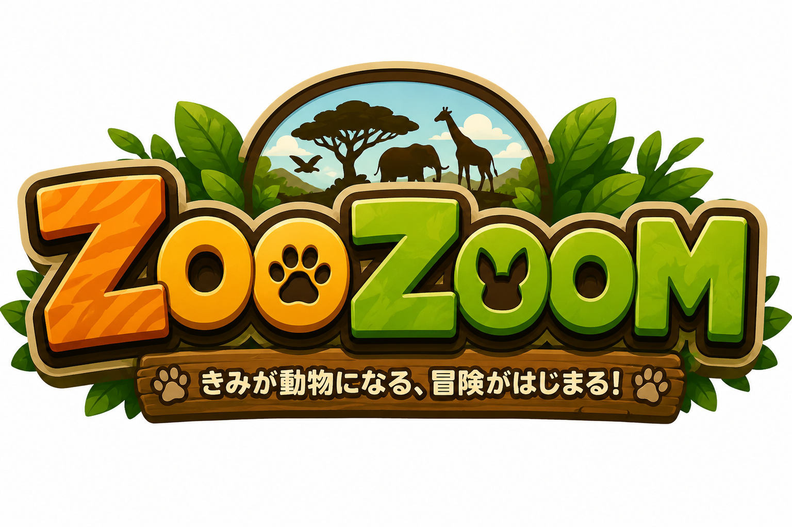
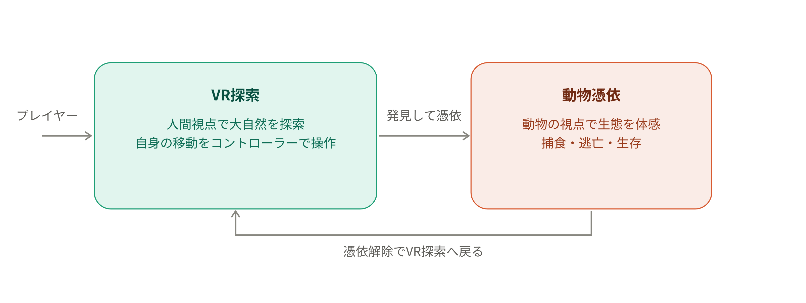
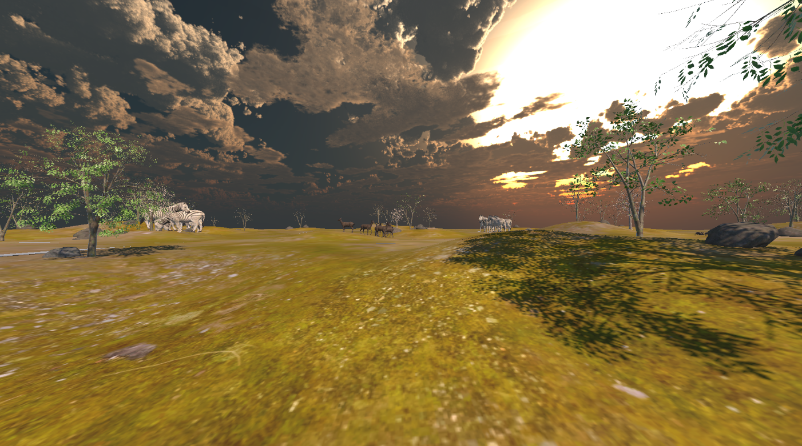
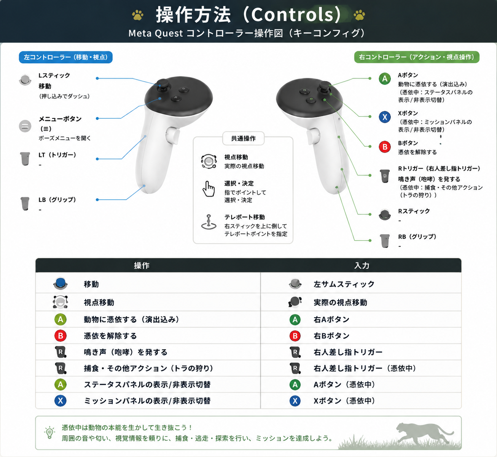
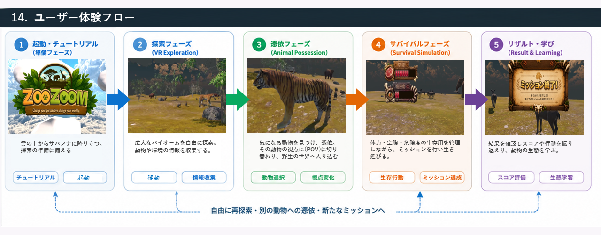

# ZOOZOOM（ズーズーム） - 没入型デジタル動物園 VR体験コンテンツ

<!-- ▼ キービジュアル（タイトル画面やメインビジュアルの画像に差し替える） -->


> 広大な自然のバイオームを冒険する「VR探索」と、動物そのものになりきって生態系を生き抜く「サバイバル・シミュレーション」が融合した、次世代の没入型デジタル動物園。

---

## 目次（Table of Contents）

### ■ ビジョン・プロダクト
1. [概要（Overview）](#1-概要overview)
2. [プロジェクト・コンセプト](#2-プロジェクトコンセプト)
3. [テーマとの関連性（Hackit2026テーマ「突破」）](#3-テーマとの関連性hackit2026テーマ突破)
4. [想定される使用用途（Use Cases）](#4-想定される使用用途use-cases)
5. [想定される使用場面（Scenes of Use）](#5-想定される使用場面scenes-of-use)

### ■ 世界観・コンテンツ
6. [主要バイオーム](#6-主要バイオーム)
8. [登場動物データ（Animal Data）](#8-登場動物データanimal-data)

### ■ ゲーム設計
9. [主要機能とコア・メカニクス](#9-主要機能とコアメカニクス)
10. [ゲームループ・ミッション・スコア設計](#10-ゲームループミッションスコア設計)
11. [動物AI・エコシステム設計](#11-動物aiエコシステム設計)
12. [オーディオデザイン方針](#12-オーディオデザイン方針)
13. [操作方法（Controls）](#13-操作方法controls)
14. [VR快適性・アクセシビリティ方針](#14-vr快適性アクセシビリティ方針)
15. [ユーザー体験フロー](#15-ユーザー体験フロー)

### ■ 技術仕様・開発環境
16. [動作環境・対応デバイス（Requirements）](#16-動作環境対応デバイスrequirements)
17. [パフォーマンス目標・技術仕様](#17-パフォーマンス目標技術仕様)
18. [開発環境](#18-開発環境)
19. [セットアップ・ビルド手順（Getting Started）](#19-セットアップビルド手順getting-started)
20. [プロジェクト構成（Project Structure）](#20-プロジェクト構成project-structure)
21. [実装スクリプト一覧（Script Reference）](#21-実装スクリプト一覧script-reference)
22. [ブランチ運用・コーディング規約](#22-ブランチ運用コーディング規約)

### ■ プロジェクト管理
23. [事前開発で行ったこと（Pre-Hackathon Preparation Log）](#23-事前開発で行ったことpre-hackathon-preparation-log)
24. [開発ロードマップ](#24-開発ロードマップ)
25. [開発スケジュール・マイルストーン](#25-開発スケジュールマイルストーン)
26. [チームメンバーと役割（Team & Roles）](#26-チームメンバーと役割team--roles)
28. [既知の不具合（Known Issues）](#28-既知の不具合known-issues)
29. [技術的な工夫と課題解決（Technical Highlights & Problem Solving）](#29-技術的な工夫と課題解決technical-highlights--problem-solving)
30. [生成AIの活用について（AI Usage）](#30-生成aiの活用についてai-usage)
31. [クレジット・使用素材（Credits）](#31-クレジット使用素材credits)
32. [参考文献（References）](#32-参考文献references)
33. [安全上の注意（Safety Notes）](#33-安全上の注意safety-notes)
34. [ライセンス（License）](#34-ライセンスlicense)

### ■ 付録
35. [用語集（Glossary）](#35-用語集glossary)
36. [今後の展望・拡張構想（Future Works）](#36-今後の展望拡張構想future-works)

---

## 1. 概要（Overview）

「ZOOZOOM」は、広大な自然のバイオームを冒険する「VR探索」と、動物そのものになりきって生態系を生き抜く「サバイバル・シミュレーション」が融合した、次世代の没入型デジタル動物園（VR体験コンテンツ）である。

プレイヤーは安全な空間にいながらにして、野生動物の視点（POV）に完全に「憑依」し、自然界の厳しさと美しさを当事者として体感することができる。

---

## 2. プロジェクト・コンセプト

**「視点が変われば、世界が変わる」**

従来の動物園やドキュメンタリー映像は「人間が動物を外側から観察する」という一方向的な体験であった。本作では、以下の2つのレイヤーで構成される多角的な体験を提供可能とする。

1. **VR Exploration (没入型探索):** 人間の視点で、ジープやボートなどの乗り物を駆使し、広大な大自然（バイオーム）を探索する爽快なアドベンチャー体験。
2. **Animal POV Simulation (独自性 - USP):** 特定の動物の視界に直接「憑依」し、捕食、逃亡、生活といった野生のルーティンを「自分事」として体験するシミュレーション。

<!-- ▼ 「VR探索」と「動物憑依」の2レイヤー構成を示す概念図 -->


---

## 3. テーマとの関連性（Hackit2026テーマ「突破」）

本作は、Hackit2026のテーマ「突破」に対して、以下の5つの観点から応えるプロダクトである。

### 解決したい課題・実現したいこと

従来の動物園やドキュメンタリー映像は「人間が動物を外側から観察する」という一方向的な体験に留まっており、**"見る側"と"見られる側"という視点の壁**を越えられない。捕食・逃走といった野生動物の"生"の瞬間に、当事者として立ち会う手段は存在しなかった。本作は、プレイヤーが動物の身体そのものに「憑依」することで、この**観察者と被観察者の境界を突破する**プロダクトである。

### 誰のためのアイデアか

- 動物園や自然に強い興味を持つ一般ユーザー
- 食物連鎖・生態系を体感的に学びたい教育現場の児童・生徒
- 外出が困難で、自然や動物との接点を持ちにくい医療・福祉施設の利用者

（詳細は第4章「想定される使用用途」を参照）

### 既存の方法の「不便さ」「足りない部分」

| 既存の方法 | 不便さ・足りない部分 |
| --- | --- |
| 実際の動物園 | 檻越しの観察に限定され、捕食・逃走の瞬間には立ち会えない |
| 映像・ドキュメンタリー | 一方向的な視聴体験で、当事者としての没入感が得られない |
| 従来のVR動物コンテンツ | 多くは「動物を見る」体験に留まり、「動物になる」体験は少ない |

本作は「憑依」という独自メカニクスで、この**当事者性の欠如を突破する**。

---

## 4. 想定される使用用途（Use Cases）

本作の「大自然への没入」と「動物への憑依」というコア機能は、エンターテインメントの枠を超え、以下のような社会的・教育的用途での活用を強力に推進可能である。

- **教育・学習機関での「体験型教材」**
  小・中学校の理科や環境学習において、食物連鎖（捕食する側・される側）や生態系の仕組みを身をもって学ぶことができる。また、気候変動や環境破壊が動物の生息域に与える影響を直感的に捉えるための、新しいSDGs学習ツールとして機能する。

- **現実の動物園・水族館・博物館での「デジタル拡張展示」**
  実際の施設での観察体験を補完するアクティビティとして導入。「本物のトラを見た直後に、VRでトラの視点になる」という相乗効果を生む。また、絶滅危惧種や、現実の施設では飼育スペースの確保が困難な巨大生物（クジラ等）の生態を、VR空間上で安全かつリアルに展示することが可能。

- **医療・福祉施設での「アニマルセラピー・リラクゼーション」**
  外出が困難な方に向けて、大自然の中で動物たちと触れ合い、鳥や草食動物の視点で穏やかな時間を過ごすリラクゼーション・ツールとしての活用。

---

## 5. 想定される使用場面（Scenes of Use）

実際にユーザーが本コンテンツをプレイするシチュエーションとして、以下の3環境を想定しています。

- **家庭でのプレイ（Home VR / リビングルーム）**
  ユーザーが自宅のプレイスペースでMeta Questを被り、数十分〜1時間程度の没入体験を楽しむ。スタンドアロン動作のため、ケーブルレスで自由に周囲を見渡し、動物の視点に合わせてしゃがむ・見上げるといった身体的なアクションが可能。

- **学校の教室・体育館（Education / グループワーク）**
  教員が操作するタブレット等とキャスト機能で連動。代表の生徒がVRヘッドセットを被って動物に憑依し、その視界（見えている世界や捕食の瞬間）を大型モニターに映し出し、クラス全体で共有・議論する授業風景を想定。

- **イベント会場・特設ブース（LBE: Location Based Entertainment）**
  商業施設や科学館のポップアップイベントでの展示。回転率を考慮し、「5分間で特定の動物の一生を体験する」というアーケードライクなショートモードを提供。着座（椅子に座った状態）でも安全に周囲を見渡せる操作オプションを用意。

---

## 6. 主要バイオーム

各エリアはMeta Quest単体での動作を考慮し、ローポリゴン・デフォルメスタイルで構築しつつ、ライティングと空間オーディオにより高い没入感を実現可能とする。

### サバンナ・エリア（広大な大地のサファリ）

- **コンセプト:**
  見渡す限りの地平線とダイナミックな時間の流れがもたらす「圧倒的なスケール感と野生の息吹」。遮るものの少ない広大な大地を活かした、開放的でスピード感のある体験。
- **主な動物とその役割:**
  - **トラ:** 疎林や丈の長い乾いた草むらに身を潜め、保護色を活かして獲物を狙う頂点捕食者。サバンナの環境においても強力な待ち伏せ狩りを行う。
  - **ゾウ:** 群れの維持と水場の確保を行う大型草食獣。大きな体格による威圧感と、木をなぎ倒すなどの環境改変ギミックでエリアにダイナミズムを与える。
  - **シマウマ:** 群れで行動し、捕食者からの警戒と高速逃走を行う被食者。ボイド的アルゴリズムによる大規模な群れの動きを見せる（詳細は第9.4節参照）。
  - **シカ:** 草原や林縁部を群れで移動し、僅かな物音や気配に警戒して跳躍しながら逃走する。プレイヤーの接近をいち早く察知するセンサー的な役割を果たす。
- **環境・地形:**
  見渡す限りの広大な草原、点在するアカシアの木々、乾季と雨季で表情を変える水場、ゴツゴツとした岩場。空間の広がりと地平線を強調することでスケールの大きさを表現。
- **演出（視覚・聴覚）:**
  - **ライティング:** リアルタイムな日照変化による、焼け付くような真昼の日差し、ドラマチックな夕焼け、そして満天の星空の表現。乾いた空気を感じさせる砂埃のエフェクト。
  - **空間オーディオ:** 遠くまで響き渡る動物たちの鳴き声、乾いた風が草原を吹き抜ける音、巨大な群れが移動する際の地響きのような足音。視界が開けているからこそ、遠方の音からイベントの発生を察知できる設計。
- **移動・インタラクション:**
  ジープに搭乗して広大な大地を高速で駆け抜ける爽快なドライブや、見晴らしの良い岩場への登頂など。見渡す限りの地平線と、巨大な動物の群れとの並走というVRならではのスケール感あふれる体験を提供。

<!-- ▼ サバンナ・エリアのインゲームスクリーンショット -->


---

## 8. 登場動物データ（Animal Data）

各動物の生息環境・食性・食物連鎖上の役割は、モデリング／AI実装／生存ミッション設計の共通仕様となる。実際のデータは、生態情報リサーチ担当（谷田・有谷）の調査結果に基づき随時更新・確定していく前提の作業用リファレンスである。生態情報の出典は「[32. 参考文献（References）](#32-参考文献references)」に記録する。

### サファリ・エリア（Phase 1 実装対象）

| 動物 | 生息場所（具体的な環境） | 主な食べ物 | 食物連鎖の役割 | 憑依時の主なミッション・特性 |
| --- | --- | --- | --- | --- |
| トラ | サバンナ | 肉食（シカ・イノシシなどの草食獣） | 捕食者（頂点捕食者） | 茂みを利用した単独での待ち伏せ・忍び寄り。強力な一撃での仕留めと縄張りの確保。 |
| ゾウ | サバンナ | 草食（草、木の葉、樹皮、果実） | 大型草食獣（ほぼ捕食されない） | 群れの維持と水場の確保。大きな体格による威圧・環境改変。 |
| シマウマ | サバンナ | 草食（主に草） | 被食者 | 群れでの警戒行動、トラなどからの高速逃走。 |
| ヒツジ | サバンナ | 草食（牧草、野草、木の葉） | 被食者（家畜／野生ではオオカミ等に被食） | 群れでの追従行動。捕食者からの逃走と密集による防御。 |
| ウマ | サバンナ | 草食（主に草、牧草） | 被食者（大型草食獣） | 開けた地形での高速逃走。群れでの警戒、後ろ足による防御。 |
| ウシ | サバンナ | 草食（牧草、野草、飼料） | 大型草食獣（家畜／野生では捕食対象） | 群れでの採食と反芻。角を使った防御、群れによる警戒。 |
| オオカミ | サバンナ | 肉食（シカ・ウサギ等の草食獣） | 捕食者（上位捕食者） | 群れ（パック）での連携狩り。長距離の追跡による獲物の消耗と包囲。 |
| シカ | サバンナ | 草食（木の葉、若芽、草、木の実） | 被食者 | 物音・気配への警戒と跳躍による逃走。茂みでの隠れ、群れでの見張り。 |
| ウサギ | サバンナ | 草食（草、若芽、樹皮、野菜） | 被食者（極めて多くの捕食者に狙われる） | 巣穴への退避と急旋回を伴う高速逃走。広い視野と聴覚による早期警戒。 |

---

## 9. 主要機能とコア・メカニクス

本作は、人間としての「観察（探索）」と、動物としての「体験（憑依）」という2つのフェーズを行き来することで、生態系を多角的に体感できる設計となっている。

### 9.1. VRバイオーム探索（Exploration）
プレイヤーはまず人間の姿で、広大なサバンナなどの自然環境（バイオーム）に降り立つ。
- **移動:** 徒歩で広大なエリアを自由に探索する。
- **観察と発見:** 遠くの群れを双眼鏡（視界ズーム機能）で観察したり、足跡や鳴き声を頼りにターゲットとなる動物を探索する、ハンティング・アドベンチャー的な楽しさを提供する。

### 9.2. 「憑依」システム（Possession System / USP）
本作最大のコア機能。発見した動物に接近し、特定のアクションを行うことで、その動物の身体・視界を完全にジャックする。
- **シームレスなスケール変化:** 人間の目の高さ（約1.5m〜1.7m）から、トラの低い視点や、ゾウの巨大な視点へとカメラの高さ・視野角（FOV）が動的に遷移し、「別の生物になった」という強烈な身体感覚（アバターへの自己投影）を生み出す。
- **知覚エフェクトの切り替え:** 単なる視点移動にとどまらず、動物ごとに異なる「世界の見え方」を表現。色彩感覚の違いや、音への敏感さ（空間オーディオの強調）など、知覚のフィルター自体が切り替わる。
- **憑依前の演出シーケンス:** Aボタンを押した瞬間に即座に憑依するのではなく、プレイヤーのリグが対象の動物の周りを実際に周回しながら見下ろし、動物側の演出アニメーション・SE・視界内オブジェクト表示・軽いカメラ振動を経てから憑依が完了する、映画的な「導入演出」を挟むことで、視点が切り替わる瞬間の説得力を高めている（詳細は第21章 `AnimalViewSwitch`、第29章参照）。

### 9.3. サバイバル・シミュレーション
動物に憑依した後は、その種族の生存戦略に基づいた固有のミッション（サバイバル）が始まる。
- **固有アクション:**
  - **トラ:** 背の高い草むらに身を隠し（ステルス・しゃがみ入力）、ターゲットの死角から忍び寄って一気に跳躍・捕食するアクション。
  - **シカ／シマウマ:** 群れの仲間と同調して動き、捕食者の接近を音と視界の端で察知し、全力で逃走（ダッシュ入力）する回避アクション。
- **生存ゲージの管理:** 画面のUI（HUD）には「空腹度」「渇き」「危険度」などのステータスが表示される。現実の数分間をゲーム内の「1日」として圧縮・体験し、ステータスを枯渇させずに生き延びることが目的となる。

### 9.4. 動的エコシステムとAI
バイオーム内の動物たちは、単なる背景ではなく、自律的なAIによって生態系（エコシステム）を形成している。
- **関係性の変化:** プレイヤーが「人間」の時は逃げていた動物たちが、プレイヤーが「トラ」に憑依した瞬間に一斉に警戒態勢を取り、逆にプレイヤーが「シマウマ」になれば、AIのトラがプレイヤーを狩りの対象として狙ってくる。憑依によって生態系の中での「立ち位置」が劇的に変化する。
- **群れ（Boids）アルゴリズム:** 草食動物は自然な群れを形成して移動・採食を行い、プレイヤーがその中に混ざる（同化する）ことで、集団の一員としての安心感や連帯感を体験できる。
- **エリアへの自動配置:** `AnimalAreaSpawner` により、指定した矩形エリア内へ動物種ごとに適切な頭数・群れ単位で自動配置される仕組みを構築済み（第11章・第21章参照）。

---

## 10. ゲームループ・ミッション・スコア設計

本作のUSPである「サバイバル体験」を、1回のプレイとして成立させるための設計。数値・評価式は実機での調整を前提とした暫定案である。

### 1プレイのループ

`ロビー → バイオーム探索 → 動物へ憑依 → サバイバル・ミッション → リザルト → アーカイブ／再挑戦`

### ミッション構造

- **主目標:** 憑依した動物ごとに設定（例：トラ＝狩りの成功、シマウマ＝一定時間の生存・逃げ切り）。
- **サブ目標:** 給水、群れとの合流、特定行動の達成など、動物の生態に沿った任意目標。
- **時間圧縮:** 現実の数分間をゲーム内の「1日」として体験する（第9章と連動）。
- **ミッション文言の動的表示:** ミッションパネルのTMProテキストは `PossessionController.SetMissionText()` により、狩りの進行状況（例：「シカが逃げ出した！追いかけろ」）に応じて実行時に書き換え可能（第21章・第29章参照）。

### 成功・失敗条件

- **生存ゲージ**（体力・空腹・危険度などのステータス）を管理し、条件を満たせずゲージが尽きると失敗となる。
- 主目標の達成、または規定時間の生存で成功（クリア）。

### スコア・評価

- 生存時間、達成した目標数、危険回避などを総合して総合評価（100点×3項目 全300点満点）。
- トラの狩りミッションでは、`AnimalViewSwitch.CalculateScore()` が「潜伏（気づかれず接近できた時間）」「追跡（対象を逃した時間による減点）」「速度（接近から仕留めるまでの速さ）」の3要素からスコアを算出し、合計値のみをHUDへ表示する設計を実装済み。

---

## 11. 動物AI・エコシステム設計

プレイヤーが憑依していないNPC動物の振る舞いと、バイオーム内の生態系の設計方針。Hackit2026期間中に基本設計を実装済みで、以下は実際に組み込んだ仕様を反映している（詳細は第21章のスクリプト一覧を参照）。

### 種族識別と近傍検索

- 全ての動物は `AnimalIdentity` で種族（Cow / Horse / Zebra / Deer / Rabbit / Elephant / Tiger / Wolf の8種）を持ち、種族ごとの静的レジストリを通じて「最も近い同種・他種の個体」「半径内の仲間」を高速検索できる。

### 行動ステート

- **通常時（待機・移動・採餌）:** `AnimalIdleBehavior` が Idle／Walk／Eat を重み付きランダムで繰り返す。群れを作る種族は、歩行先の決定時に `HerdBehavior` の補正（後述）を受ける。
- **逃走:** `FleeFromPredators` が、シーン内の `Predator` マーカーを持つ個体との距離を監視し、検知距離内に入ると反対方向へNavMeshで逃走する。
- **狩り（捕食者側）:** `PredatorAI` が種族ごとに「無視する（Ignore）」「発見→忍び寄り／様子見→追跡→捕食（Engage）」を設定でき、Notice／Chase／Catchの3段階の距離としきい値で行動を切り替える。
- **同格捕食者同士のケンカ:** `PredatorAI` の Rival Reactions により、一定時間（Fight Duration）攻撃し合った後は自動的に反対方向へ離脱し、一定時間（Cooldown）は同じ相手と再度ケンカしないようクールダウンする（無限にケンカし続ける状態を防止）。
- **捕食・死亡:** 捕食が成立すると `AnimalHealth.Kill()` が呼ばれ、対象の移動・AI系コンポーネントを全て無効化したうえで死亡アニメーションを再生し、一定時間後にオブジェクトを非表示にする。

### 群れ行動（Boids）

- `HerdBehavior` が、同種の近傍個体の重心（結合・Cohesion）と、近すぎる個体からの反発（分離・Separation）を計算し、`AnimalIdleBehavior` の次の歩行先にバイアスとして加算する。群れの中心から一定距離以上離れないための上限（`Herd Radius`、はぐれ防止）も設定できる。
- 群れを作らない種族（トラ・オオカミなど単独〜小規模パック行動の動物）は `HerdBehavior` のパラメータや群れサイズで挙動を調整する。
- 動物種ごとの`HerdBehavior`パラメータ（Herd Radius／Cohesion Weight／Separation Distance／Separation Weight）は、体格・群れの性質（密集しやすい／広く分散するなど）を踏まえてチューニング済み。牛・馬・シマウマ・シカ・ゾウ・ウサギ・オオカミそれぞれに異なる初期値を設定している。

### エリアへの自動配置（`AnimalAreaSpawner`）

- 指定した矩形エリア（`Area Center` / `Area Size`）内に、動物種ごとに設定した総数を自動配置するスポナーを実装済み。
- **群れを作る種族:** 群れサイズの範囲（例：シマウマ4〜7頭）でランダムに群れを分割し、群れの中心点同士が一定距離以上離れるように配置したうえで、各群れの中心周辺に個体を散らして配置。配置後、同じ群れのメンバー同士を`HerdBehavior.SetHerdMembers()`で自動的に紐付ける。
- **単独行動の種族（トラ・オオカミなど）:** 他の個体・群れの中心から最低距離を確保しつつランダム配置。
- 候補座標は`NavMesh.SamplePosition`でNavMesh上の有効な位置に補正されるため、地形にめり込んだ状態での配置を防止している。

### 捕食者と被食者の相互作用

- プレイヤーが被食者に憑依している間は、周囲の捕食者AI（`PredatorAI`）がそのまま脅威として機能する。
- プレイヤーが捕食者（トラ）に憑依すれば、周囲の被食者AI（`FleeFromPredators`）がプレイヤー自身を脅威として認識し、逃走行動を取る。
- 憑依中は、その個体自身の `AnimalIdleBehavior` / `FleeFromPredators` / `PredatorAI` を無効化し、NPC用のAIとプレイヤー操作が競合しないようにする。

### 今後の拡張（Phase 2以降）

- エサ資源・水場・昼夜サイクルに応じた行動変化の追加。
- 遠景の個体に対するAI処理の簡略化（AI LOD、第29章参照）による負荷軽減。
- 群れパラメータ（Herd Radius／Cohesion Weight等）の実機でのバランス調整（初期値は設定済みだが、実機での見え方に応じた微調整が今後の課題）。

> ※ 各パラメータの具体的な数値は動物ごとにInspectorで調整可能。実機での調整記録は第29章「技術的な工夫と課題解決」に追記していく。

---

## 12. オーディオデザイン方針

空間オーディオを没入の柱の一つと位置づけ、視覚負荷を抑えつつ臨場感を担保する。

- **空間オーディオ（3D音響）:** 音の方向・距離を知覚できるようにし、背後の捕食者の気配などを音で伝える。
- **動物の鳴き声・SE:** 各動物の鳴き声、足音、捕食・咀嚼音などを用意。憑依中は動物の聴覚に寄せた聞こえ方も検討する。
- **環境音（アンビエンス）:** バイオーム・時間帯ごとに環境音のレイヤーを切り替え、空間の実在感を高める。
- **BGM:** 世界観を支える控えめな楽曲を基本とし、捕食・逃走などの緊張場面では動的に変化させる。
- **素材管理:** 外部サイトから取得した音源は、ダウンロード時点で「[31. クレジット・使用素材（Credits）](#31-クレジット使用素材credits)」の表に必ず記録する。

---

## 13. 操作方法（Controls）

Meta Quest コントローラーを使用します。直感性を重視し、VR酔いを軽減する設計。

<!-- ▼ Meta Questコントローラーのボタン配置図（キーコンフィグ図） -->


| 操作 | 入力 |
| --- | --- |
| 移動 | 左サムスティック |
| 視点移動 | 実際の視点移動 |
| 動物に憑依する（演出込み） | 右Aボタン |
| 憑依を解除する | 右Bボタン |
| 鳴き声（咆哮）を発する | 右人差し指トリガー |
| 捕食・その他アクション（トラの狩り） | 右人差し指トリガー（憑依中） |
| ステータスパネルの表示/非表示切替 | Aボタン（憑依中） |
| ミッションパネルの表示/非表示切替 | Xボタン（憑依中） |

---

## 14. VR快適性・アクセシビリティ方針

医療・福祉・教育といった幅広い用途を想定するため、VR酔いの軽減と、誰もが安全に体験できる設計を重視する。

- **移動酔い（VR酔い）対策:** 視点回転はスナップターンを標準とし、急激な視界変化を避ける。
- **憑依演出時の酔い対策:** 憑依前の周回演出（`AnimalViewSwitch`）では、リグの回転を`Quaternion.RotateTowards`による滑らかな補間にし、急激な視界回転を避けている。また、演出後半の「カメラ微振動」は上下方向の揺れ幅を左右の半分に抑え、時間経過で減衰させることでVR酔いへの配慮をしている。
- **姿勢オプション:** 立位と着座の両方に対応。LBEや福祉施設での利用を想定し、着座のまま全方位を見渡せる操作を用意する。

---

## 15. ユーザー体験フロー

1. **起動・エリア選択:** 没入空間のロビーから、鳥とともに雲へダイブ。
2. **VR探索:** 徒歩でバイオーム内を自由に探索し、ターゲットとなる動物を探す。
3. **接触と憑依:** 発見した動物に接近・インタラクトすることで、周回演出→演出アニメーション→視点切り替えの流れで憑依が完了する。
4. **サバイバル体験:** 動物として数分間のサバイバル・シミュレーション（ミッション）を開始。
5. **リザルト:** 生存時間や達成した目標に応じた評価が表示される。

<!-- ▼ 体験フロー全体を示すフロー図（起動→探索→憑依→サバイバル→リザルト） -->


---

## 16. 動作環境・対応デバイス（Requirements）

Meta Quest 単体での**スタンドアロン動作**を前提とし、PCレスで手軽に体験できることを重視する。

| 項目 | 内容 |
| --- | --- |
| 対応デバイス | Meta Quest 3 / Quest 3S（主対象）、Meta Quest 2（動作対象・要検証） |
| 動作形態 | スタンドアロン（ケーブルレス）／ PC接続は不要 |
| トラッキング | 6DoF（ヘッドセット＋Touchコントローラー） |
| プレイエリア | ルームスケール／着座モードの両対応 |
| 必要ストレージ | 約 ○○ GB（TBD：ビルド確定後に更新） |
| 動作確認済み環境 | TBD（例：Meta Quest 3 / OSビルド番号◯◯ で動作確認済み — 提出前に実測して記載） |
| 外部出力 | 教育・グループ利用向けにキャスト／ミラーリングに対応予定 |

> ※ 対応機種・必要ストレージは開発の進行に応じて確定・更新する。

---

## 17. パフォーマンス目標・技術仕様

Meta Quest のモバイルGPUという制約下で、快適なフレームレートと没入感を両立させることを最優先とする。

- **目標フレームレート:** 72fps を最低ライン、可能な範囲で 90fps を目標とする（VR酔い防止の観点で最重要指標）。
- **描画方針:** ベイクドライティングを基本とし、リアルタイムライトは最小限に抑える。
- **最適化手法:** GPU Instancing、Occlusion Culling、LOD、テクスチャアトラス化とASTC圧縮、Fixed Foveated Rendering などを活用。
- **予算（Budget）:** 1フレームあたりのドローコール数・ポリゴン数の上限は、実機検証を経て確定する。
- **オーディオ:** 空間オーディオにより、視覚負荷を抑えつつ没入感を担保する。

---

## 18. 開発環境

| 項目 | 内容 |
| --- | --- |
| Game Engine | Unity 2022.3 LTS |
| 3D Modeling | Blender 4.43 |
| SDK | Meta SDK v60以上 (All-in-One SDK) |
| Version Control | GitHub Desktop / Git LFS |

---

## 19. セットアップ・ビルド手順（Getting Started）

新規メンバーが開発を始めるための手順。**バイナリアセットは Git LFS で管理**しているため、GitHub Desktopを使用してクローンを行う。

### 前提ツール

- Unity Hub ＋ Unity 2022.3 LTS（Android Build Support / OpenJDK / Android SDK & NDK を含めてインストール）
- Blender 4.0 以上
- **GitHub Desktop**
- Meta SDK v60 以上（All-in-One SDK）

### 手順（GitHub Desktopを使用）

1. **GitHub Desktop** を起動し、GitHubアカウントでサインインする。
2. メニューから `File > Clone repository...` を選択する。
3. `URL` タブ（または `GitHub.com` タブ）を選択し、本リポジトリを選択するかURLを入力して `Clone` ボタンをクリックする。
   > ※ GitHub Desktopは標準で Git LFS に対応しているため、特別なコマンドを入力しなくても自動的にLFS管理のバイナリファイルが正しく取得されます。
4. **Unity Hub** を起動し、「リストに追加（Add）」から、クローンしたプロジェクトのフォルダを選択して Unity 2022.3 LTS で開く。
5. 初回起動時に **Meta SDK（All-in-One SDK）** をインポートし、必要なセットアップ（権限・マニフェスト等）を適用する。
6. Unityメニューの `File > Build Settings` でプラットフォームを **Android** に切り替える。
7. Meta Quest を開発者モードで PC に接続し、**Build And Run** で実機へビルド・転送する。

---

## 20. プロジェクト構成（Project Structure）

`Assets/` 配下のフォルダ構成（暫定）。役割ごとにディレクトリを分け、アセットの所在を明確にする。

```text
Assets/
├── Animals/        # 動物のモデル・アニメーション・憑依用データ
├── Biomes/         # バイオーム（サファリ等）の環境アセット・シーン
├── Scripts/        # C#スクリプト（憑依システム、プレイヤー制御、AI 等）
├── Audio/          # BGM・SE・環境音・空間オーディオ設定
├── UI/             # UI・HUD・メニュー
├── Prefabs/        # 再利用プレハブ
├── Materials/      # マテリアル・シェーダー
├── Settings/       # レンダリング／プロジェクト設定
└── ThirdParty/     # 外部アセット・SDK関連
```

---

## 21. 実装スクリプト一覧（Script Reference）

Notion上のタスク分けを基に設計した、`Assets/Scripts/` 配下の実装スクリプト一覧である。名称・責務をあらかじめチームで統一しておくことで、当日の並行作業時のファイル競合・命名ブレを防ぐことを目的とする。ハッカソン期間中に実装が完了したものは実装状況を随時更新する。

### `Assets/Scripts/Animals/`（動物AI・生態系）

| スクリプト名 | 責務 | アタッチ対象 |
| --- | --- | --- | --- |
| `AnimalIdentity` | 種族（Cow/Horse/Zebra/Deer/Rabbit/Elephant/Tiger/Wolf）の識別と、種族ごとの近傍検索用レジストリの提供 | 全動物 |
| `AnimalHealth` | 被食・死亡処理。死亡時に他のAIコンポーネントを無効化し、死亡アニメーション再生後にオブジェクトを非表示化 | 全動物 |
| `AnimalIdleBehavior` | Idle／Walk／Eatを重み付きランダムで繰り返す通常時の徘徊AI。群れ・逃走・狩り中の一時停止に対応 | 全動物 |
| `Predator` | 「捕食者である」ことを示すマーカーコンポーネント | トラ・オオカミ |
| `FleeFromPredators` | 捕食者の検知・NavMeshを用いた逃走先の計算・Animator連携 | 牛・馬・シマウマ・シカ・ウサギ・ゾウ |
| `PredatorAI` | 種族ごとの狩り対象設定（無視／発見・忍び寄り・追跡・捕食）、同格捕食者とのケンカ・自動離脱・クールダウン | トラ・オオカミ |
| `HerdBehavior` | 群れの結合（中心への引き寄せ）・分離（近すぎる仲間からの反発）を計算し、徘徊先にバイアスをかける。動物種ごとにパラメータをチューニング済み | 牛・馬・シマウマ・シカ・ゾウ・ウサギ・オオカミ |
| `AnimalAreaSpawner` | 指定エリア内へ、動物種ごとに設定した頭数を自動配置。群れを作る種族は複数の群れに分けて`HerdBehavior`のメンバーを自動紐付けし、単独種は他個体と距離を保って配置する | エリア管理用の空GameObject |

### `Assets/Scripts/Possession/`（憑依システム）

| スクリプト名 | 責務 | アタッチ対象 | 実装状況 |
| --- | --- | --- | --- |
| `AnimalViewSwitch` | 距離判定に基づく憑依開始（Aボタン）・解除（Bボタン）、憑依前の周回演出（周回移動→演出アニメーション→演出オブジェクト表示→SE→カメラ微振動）、視点・位置の同期、鳴き声再生、狩りアクション・スコア算出 | 憑依可能な全動物 |
| `HUDFollowViewpoint` | 憑依中HUDのCanvasをプレイヤーのカメラ（CenterEyeAnchor）へ追従させる | HUD用Canvas |

### `Assets/Scripts/UI/`（HUD）

| スクリプト名 | 責務 | アタッチ対象 | 実装状況 |
| --- | --- | --- | --- |
| `PossessionController` | 憑依中の各パネル（ミッション／ステータス／ミッション完了／スコア／操作案内）の表示・非表示（CanvasGroupによるフェード切替）・内容更新。ミッション文言のTMProを動的に書き換え可能 | HUD用Canvas |

### `Assets/Scripts/Player/`（プレイヤー制御）

| スクリプト名 | 責務 | アタッチ対象 | 実装状況 |
| --- | --- | --- | --- |
| `VRMovement` | スティック移動・ダッシュ・重力処理に加え、指定した開始地点/終了地点間の自動移動（transform.position直接制御によるXYZ全軸移動、Quest描画前の誤作動防止、到着後のめり込み自動解消を含む） | プレイヤーリグ |

### `Assets/Scripts/SceneManagement/`（シーン遷移）

| スクリプト名 | 責務 | アタッチ対象 | 実装状況 |
| --- | --- | --- | --- |
| `CloudTagSceneChanger` | 指定タグ（デフォルト`CloudTag`）を持つオブジェクトへの接触を検知し、指定シーンへ遷移する | プレイヤーの手・コントローラー等（触れる側） |

> ※ 上記以外の予定スクリプト（乗り物、リザルト画面、生存ゲージの増減ロジック、環境音・BGM制御など）は本書執筆時点で未着手（📋）。実装が進み次第この表を更新する。

---

## 22. ブランチ運用・コーディング規約

チーム開発での競合と手戻りを防ぐための暫定ルール。詳細は運用しながら整備していく。

### ブランチ運用

- `main` : リリース／安定版。直接コミットは禁止。
- `develop` : 開発の統合ブランチ。
- `feature/<機能名>` : 機能単位の作業ブランチ。`develop` から分岐し、Pull Request でマージする。
- マージ前にはレビューを行い、シーンやプレハブの競合に特に注意する。

### Git LFS 対象

- `.fbx` `.blend` `.png` `.psd` `.tga` `.wav` `.mp3` などのバイナリアセットは LFS で管理する。

### コーディング規約（C# / Unity）

- クラス名・メソッド名は PascalCase、ローカル変数・引数は camelCase、定数は UPPER_SNAKE_CASE を基本とする。
- 1スクリプト1責務を意識し、憑依システム・プレイヤー制御・AI などは疎結合に保つ。
- コミットメッセージは「何を・なぜ」変更したかが分かる簡潔な記述とする。
- 第21章の命名・責務定義を正とし、当日の実装はこの一覧に沿って進める（変更が必要な場合はチームに共有のうえ本章・第21章を更新する）。

---

## 23. 事前開発で行ったこと（Pre-Hackathon Preparation Log）

### 準備内容一覧

| 分類 | 実施内容 | 成果物・関連セクション |
| --- | --- | --- |
| 企画・コンセプト策定 | 「視点が変われば、世界が変わる」というコンセプト、および「憑依」というUSPを定義し、Hackit2026テーマ「突破」との関連性を整理 | 第2章・第3章 |
| README／企画書の作成 | 本README（企画書兼開発ドキュメント）の全体構成・ドラフトを作成 | 本書全体 |
| 生態データ調査 | サファリ・エリア対象動物（トラ・シマウマ等）の生息環境・食性・食物連鎖上の役割をリサーチし、出典を記録 | 第8章・第32章 |
| Notionタスク設計 | Notionインポート用のCSV形式タスクリスト（サブステップのチェックリスト付き）を作成 | 第24章・第25章 |
| スクリプト設計（設計のみ・実装は含まない） | 実装予定の約55本のC#スクリプトについて、命名規則・責務・フォルダ構成を事前に整理 | 第21章 |
| 開発環境の構築・確認 | GitHub Desktop ＋ Git LFS 連携の動作確認、Unity 2022.3 LTS ＋ Meta SDK のセットアップ手順の整理 | 第18章・第19章・第20章 |
| アートディレクション方針の策定 | ローポリゴン＋デフォルメスタイルの方向性、モデリング規約の骨子を策定（配色等の詳細は未確定） | 第7章 |
| 画面モックアップの作成 | タイトル・探索・サバイバル・リザルトなど主要画面、計3画面のモックアップを作成 | 第15章 |
| プロモーションデモの作成 | Three.js製のアニメーションHTMLプロモーションデモを作成し、コンセプトを視覚的に共有 | 第2章 |
| 開発ロードマップ・スケジュール策定 | Phase 1〜3の開発ロードマップ、3日間のタイムテーブル（マイルストーン）を策定 | 第24章・第25章 |
| 役割分担の確定 | 5名のチームメンバーの役割・担当ツールを確定 | 第26章 |

## 24. 開発ロードマップ

本プロジェクトは、限られた開発期間（Hackit2026）でコアとなる体験を完成させる「Phase 1」と、その後のプロダクト価値を段階的に高めていく「Phase 2」「Phase 3」の3段階で開発を計画している。

### Phase 1: MVP（Minimum Viable Product）開発 ＆ コア体験の確立
**目標:** 「VR探索」と「憑依」という本作の基本ループを1本のデモとして完成させる。
- サバンナ・エリアのベース環境（地形、日照ライティング、基本の空間オーディオ）構築。
- プレイヤーの基本操作（徒歩移動・視点操作）と、「憑依システム」のプロトタイプ実装。
- **トラ**による「待ち伏せ・捕食」、およびターゲットとなる**シマウマ**の「逃走」に絞り、サバイバル・シミュレーションの1プレイ（探索→憑依→狩り→リザルト）を成立させる。

### Phase 2: エコシステム（生態系）の高度化と探索要素の拡充
**目標:** 「動物園」としてのリアリティを深め、リプレイ性の高いシミュレーション環境を構築する。
- プレイアブル動物の拡充（**ゾウ**による環境操作・威圧、**シカ**による高感度センサー的な逃走アクションの追加）。
- 動物AIの自律性向上（ボイドアルゴリズムによる大規模な群れの形成、昼夜や空腹度に応じた行動変化）。
- 人間視点での体験強化として、ジープ搭乗による広大なサバンナの高速ドライブ移動を実装。

### Phase 3: バイオームの拡張とソーシャル・教育機能の統合（中長期ビジョン）
**目標:** エンターテインメントの枠を越え、教育現場や展示施設（B2B/B2E）で活用できるプラットフォームへの進化。
- 新規バイオーム（ジャングル・オーシャン・アークティック）の追加と、それに伴う新たな動物種・操作体系（スイング、遊泳など）の実装。
- プレイヤー同士で生態系を共有する「マルチプレイ機能（捕食者vs被食者の対戦、群れでの協力行動）」。
- 教育現場向けの「管理者ガイドモード」および、プレイ結果から生態系を学ぶ「デジタル図鑑」の導入。

---

## 25. 開発スケジュール・マイルストーン

Hackit2026の3日間の開催期間（実質開発時間：約16.5時間）で、Phase 1（MVP）を完成させ、デモ発表を成功させるための詳細なスケジュールである。16:00の中間発表をマイルストーンとして、細かくビルドと結合テストを行う。

### 8月1日（土）Day 1：基盤構築とプロトタイプ結合
**目標:** プレイヤーの基本操作と「憑依」のプロトタイプを実機で動かす。

| チーム全体の目標・マイルストーン | 各担当の主なタスク |
| --- | --- |
| **環境構築とベースシーン作成** | **Unity:** LFS/GitHub連携確認、ベース地形作成、移動処理<br>**Blender:** トラ・シマウマの基礎モデリング開始<br>**Audio/TA:** 環境音・足音の選定、マテリアル設定準備 |
| **憑依システムのプロトタイプ実装** | **Unity:** ターゲットへの接近判定、視点切り替え処理<br>**Blender:** メイン動物のボーン・待機/走行アニメーション<br>**Audio/TA:** 空間オーディオの実装テスト |
| **狩り・逃走ループの仮組み** | **Unity:** トラの跳躍、シマウマの逃走AI、初期UI（ゲージ類）<br>**Blender:** サバンナの環境プロップ（草・岩・木）の量産 |

### 8月2日（日）Day 2：エコシステム実装と演出強化
**目標:** ゲームループ（探索→憑依→狩り→リザルト）を完成させ、没入感を高める。

| チーム全体の目標・マイルストーン | 各担当の主なタスク |
| --- | --- |
| **ゲームループの結合と調整** | **Unity:** ミッション進行、リザルト画面、スコア計算<br>**Blender:** ゾウ・シカなど追加動物のモデリング・調整<br>**Audio/TA:** 憑依時のBGM変化、環境音のレイヤー化 |
| **グラフィックとパフォーマンス最適化** | **Unity:** AIの挙動微調整、バグ修正、UIの視認性向上<br>**Blender/TA:** ポリゴン数削減（LOD）、テクスチャ圧縮<br>**全体:** 実機（Quest）でのfps計測と酔い対策（ビネット等） |
| **最終ブラッシュアップ・テストプレイ** | **全体:** 通しプレイでのバランス調整、致命的なバグの洗い出しと修正。発表用スクリーンショット・動画の撮影 |

### 8月3日（月）Day 3：発表準備
**目標:** 安定した最終ビルドの提出と、魅力を伝えるプレゼンテーション。

| チーム全体の目標・マイルストーン | 内容 |
| --- | --- |
| **最終ビルド作成** | 致命的なエラーの修正のみを実施。最終ビルドとGitHubへのプッシュを完了させる。 |
| **資料作成** | 発表用資料の作成 |

---

## 26. チームメンバーと役割（Team & Roles）

| 名前 | 役割 | 担当ツール |
| --- | --- | --- |
| 黒川 稜真 | リードエンジニア / 企画・レベルデザイン / 憑依システム・プレイヤー制御・ネットワーク実装担当 | Unity |
| 小林 淳寛 | 3Dモデラー / 動物のアセット作成・アニメーション・環境作成 / 描画最適化担当 | Blender |
| 有谷 祐軌 | オーディオインプリメンター / 動物の生態情報リサーチ / UIデザイン / 動物のアセット作成・アニメーション・描画最適化担当 | Unity |
| 谷田 裕太 | テクニカルアーティスト (TA) / 動物の生態情報リサーチ / 空間オーディオ設定・環境音・BGM・SE制作・選定 | Unity |
| 相山 莉子 | 3Dモデラー / 動物のアセット作成・アニメーション・環境作成| Blender |

---

## 28. 既知の不具合（Known Issues）

把握済みの不具合と回避策の一覧。審査員のデモプレイ中に発生した場合も「認識済み」であることを示せるよう、発見次第ここに記録する。**解決済みのものも削除せず、開発過程の記録として残す**（第29章の課題解決ログとも対応）。

| ID | 症状 | 発生条件 | 状態・回避策 |
| --- | --- | --- | --- |
| #001 | （例）憑依解除時に一瞬視点が地面にめり込む | 動物が移動中に憑依解除した場合 | 調査中。静止時に解除すれば発生しない |
| #002 | `NavMeshAgent.remainingDistance`呼び出し時に例外（"can only be called on an active agent that has been placed on a NavMesh"） | 憑依中に動物がNavMesh範囲外へ移動した場合、スポーン位置がNavMesh外だった場合 | ✅解決済み。`AnimalIdleBehavior`/`PredatorAI`のUpdateに`agent.isOnNavMesh`チェックを追加し、憑依中は該当AIコンポーネント自体を無効化 |
| #003 | 狩り対象を発見した動物のアニメーションが異常な速度で再生される | `PredatorAI`が索敵間隔（0.3秒）ごとに同じTriggerを再発火させていた | ✅解決済み。現在の行動状態（Watching/Stalking/Chasing）を保持し、状態が変化した時だけTriggerを発火するよう修正 |
| #004 | 静止しているのにWalkアニメーションが再生される／移動中なのにIdleが再生される | Animatorに新旧2種類の遷移（Any State方式と個別State間の直接遷移）が混在し、一部の矢印で`Has Exit Time`がオンのまま残っていた | 🚧対応中。全遷移をAny State方式に統一し`Has Exit Time`をオフにする作業を実施中 |
| #005 | HUDのCanvasがVRで頭を動かしても追従しない | `viewpoint`にカメラの子ではなく`OVRCameraRig`ルートを参照していた（回転が伝わらない） | ✅解決済み。`CenterEyeAnchor`を直接参照し、`HUDFollowViewpoint`をカメラの子として付け替える方式に変更 |
| #006 | 自動移動（`VRMovement`）が終了地点を通過してしまう | 1フレームの移動量が残り距離より大きい場合、目的地を追い越していた | ✅解決済み。1フレームの移動量を残り距離でクランプし、到達判定時に座標を最終的にピッタリ合わせる処理を追加 |
| #007 | 自動移動の終着点で高さ(Y座標)が意図通りにならない・落下する | 当初は水平移動のみで高さを重力任せにしており、Character ControllerのCenter/Heightのオフセットも考慮していなかった | ✅解決済み。transform.positionを直接3軸制御する方式に統一し、開始・終了地点のYがそのまま反映されるよう変更（詳細は第29章） |
| #008 | 自動移動の到着直後に「ストン」と落下する／開始直後にも同様の現象が起きる | `CharacterController.isGrounded`はMove()呼び出し後でないと正しく判定されず、起動直後や自動移動終了直後に一瞬「浮いている」と誤判定され、重力が過剰に加算されていた | ✅解決済み。`Start()`時に小さく下方向へMove()して初期接地判定を正しくする処理と、自動移動終了時に`verticalVelocity`をリセットする処理を追加 |
| #009 | 自動移動の到着後、その場から一切動けなくなる | transform.positionを直接動かす方式にしたことで衝突判定を経由せず、境界条件次第でCharacter Controllerのカプセルが地形にわずかにめり込むケースがあった | ✅解決済み。到着直後に`Physics.OverlapCapsule` + `Physics.ComputePenetration`でめり込みを検出し、Skin Width以上のめり込みだけを自動的に押し出す処理を追加（正常な接地は誤って押し出さないよう除外） |
| #010 | Quest実機で、実際に描画される前にキャラクターが動き出してしまう | `Start()`の時点ではOVRのHMDトラッキング・VRフォーカスがまだ確立しておらず、その状態でCharacterController.Move()が呼ばれていた | ✅解決済み。`OVRManager.instance.isHmdPresent`と`OVRManager.hasVrFocus`の両方が揃うまで待機するコルーチンを追加し、揃った後も追加の待機時間を設けてから自動移動を開始するよう変更 |
| #011 | 憑依演出アニメーションが再生されない | ①AnimatorのState間の遷移が「roar → Any State」という逆方向に組まれており「Any State → roar」の遷移が存在しなかった／②`possessionIntroClip`(AnimationClip直接指定欄)に誤って通常のClipが設定されており、レガシーAnimationコンポーネントでの再生が優先されてLegacy未マークの警告が出ていた | ✅解決済み。Animatorの遷移方向を修正し、Trigger方式とClip方式の優先順位を明確化（Clip未設定ならTrigger方式にフォールバック） |
| #012 | Animatorが複数アタッチされている動物で、意図しない方が使われる | `GetComponentInChildren<Animator>()`は最初に見つかった1つを返すだけで、複数ある場合にどちらが取れるか保証されない | ✅解決済み。攻撃用・演出用それぞれのAnimatorをInspectorで直接アタッチする方式に変更し、未設定時のみ自動取得にフォールバックするよう修正 |
| #013 | HUDのパネル切り替えが瞬間的でチープに見える | 全パネルが`SetActive(true/false)`による瞬時切り替えのみだった | ✅解決済み。CanvasGroupのalphaをコルーチンでフェードさせる共通ヘルパーを実装し、既存の呼び出しコードを変更せずに全パネルの表示/非表示を動的なフェードに置き換え |
| #014 | 群れを作る動物の徘徊先が群れ補正されない | `AnimalIdleBehavior`は`HerdBehavior.GetHerdAdjustedDestination()`を呼び出す設計だったが、`HerdBehavior`自体がまだ実装されていなかった | ✅解決済み。結合（Cohesion）・分離（Separation）を計算する`HerdBehavior`を新規実装 |

---

## 29. 技術的な工夫と課題解決（Technical Highlights & Problem Solving）

技術審査向けに、本プロジェクトで特に注力した実装・工夫と、開発過程で実際に直面した課題・解決策をまとめる。前半（29.1）は設計上のハイライト、後半（29.2）は「課題→原因→解決策」の形式で実装過程のログを詳細に記録している。

### 29.1 設計上の技術的ハイライト

- **憑依システムの視点遷移:** 人間視点⇔動物視点の切り替え時に、カメラ高さ・視野角・移動速度・IPD相当のスケール感を動物ごとのパラメータで補間し、VR酔いを抑えつつ「身体が変わった」感覚を演出する設計。憑依直前には、動物の周りをカメラが実際に周回する導入演出（`AnimalViewSwitch`）を挟むことで、視点切り替えの唐突さを緩和している。
- **Quest単体でのパフォーマンス最適化:** モバイルGPU制約下で72fpsを維持するため、ベイクドライティング＋GPU Instancing＋LOD＋ASTC圧縮を組み合わせた最適化パイプラインを構築。
- **動物AIの負荷制御:** プレイヤーからの距離に応じてAIの更新頻度・ステート複雑度を段階的に落とす「AI LOD」により、多数の動物を同時に動かしながら処理負荷を抑制。
- **空間オーディオによる情報設計:** 背後の捕食者の気配など「視覚外の脅威」を3D音響で伝えることで、描画負荷を増やさずに緊張感と没入感を向上。
- **24〜30時間での開発マネジメント:** WBS・Notionによるタスク分解（第21章のスクリプト一覧を含む）と、5人の役割分担（Unity実装／Blenderモデリング／オーディオ・TA）の並列化により、短期間でのコア体験完成を目指す体制を構築。
- **Animatorの「Any State」統一設計:** 動物ごとにState数・遷移パターンが異なると管理コストが増大するため、全動物のAnimator ControllerをIdle／Walk／Eat／Run／Attack／Die（捕食者のみAttack）の状態群とし、個別State間の直接遷移ではなく「Any State→各State」への統一遷移で構成。どの状態にいてもTriggerが立った瞬間に確実に反応する設計とし、複数動物への横展開を容易にした（実装過程で発生した遷移方向の逆転ミスとその修正は29.2の#F6を参照）。
- **種族横断の汎用AIコンポーネント:** `PredatorAI`／`FleeFromPredators`／`HerdBehavior`は特定の動物専用に書かず、Inspector上のリスト設定（対象種族・Ignore/Engageモード・各種距離やパラメータ）だけで挙動を変えられる汎用コンポーネントとして設計。トラ・オオカミという2種の捕食者、および6種の被食者を、スクリプトの複製なしに個別調整できる。
- **狩り・ケンカの自然な終息:** 捕食者同士のケンカが無限ループしないよう、一定時間で自動的に離脱しクールダウンに入る設計を導入。生態系としての説得力と、デモ中に不自然なループが続くリスクの両方に対応。
- **エリア単位での動物自動配置:** `AnimalAreaSpawner`により、群れを作る種族・単独行動の種族を区別しつつ、NavMesh上の有効な座標のみに動物を自動配置する仕組みを構築。手動配置の手間を排除し、動物種の追加・頭数調整をInspectorの数値変更だけで完結できるようにした。

### 29.2 課題解決ログ（Challenge → Cause → Solution）

開発中に実際に直面した実装上の課題を、発生した順に「課題」「原因」「解決策」の形式で記録する。第28章「既知の不具合」の該当IDと対応している。

#### プレイヤー移動・自動移動システム（`VRMovement.cs`）

| # | 課題 | 原因 | 解決策 |
| --- | --- | --- | --- |
| F1 | 自動移動が終着点を通過してしまう | 1フレームあたりの移動量が残り距離より大きい場合、目的地を追い越してしまっていた | 1フレームで進む距離を残り距離でクランプし（`Mathf.Min`）、到達判定時には座標を最終的にピッタリ目的地へ合わせる処理を追加（#006） |
| F2 | 終着点のY座標（高さ）が意図と異なる／落下する | 水平移動のみを制御し、高さは重力任せにしていたため、Character ControllerのCenter/Heightのオフセットとズレが生じていた | 開発初期はGround Raycastによる高さ自動補正を試みたが、ベイク済みモデルを扱う都合上「高さを固定したくない」という要望が出たため、最終的に**transform.positionでXYZ全軸を直接制御する方式**に統一。開始・終了地点のYがそのまま反映されるようにした（#007） |
| F3 | 自動移動の開始直後・終了直後に「ストン」と落下する | `CharacterController.isGrounded`はMove()呼び出し後でないと正しく判定されず、最初の数フレームは強制的に`false`扱いになるため、重力が過剰に加算されていた | `Start()`内で一度だけ小さく下方向にMove()して`isGrounded`を正しく初期化する処理と、自動移動終了時に`verticalVelocity`をリセットする処理を追加（#008） |
| F4 | 自動移動終了後、その場から一切動けなくなる | transform.position直接制御は衝突判定を経由しないため、着地位置によってはCharacter Controllerのカプセルが地形にわずかにめり込むことがあり、次のMove()呼び出し時にめり込みが解消できず固まっていた | 到着直後に`Physics.OverlapCapsule`と`Physics.ComputePenetration`でめり込みを検出し、自動的に押し出す処理を追加。ただし通常の接地時に発生するSkin Width程度のごく僅かな重なりまで押し出すと逆に浮いてしまうため、**Skin Widthを超える明らかな異常なめり込みのみ**を対象にするよう調整（#009） |
| F5 | Quest実機で、実際にヘッドセットに映像が表示される前にキャラクターが動き出してしまう | `Start()`時点ではOVRのHMDトラッキング・VRフォーカスの確立前であり、その状態でCharacterController.Move()を呼ぶと、ユーザーが気づかないうちに移動が進行してしまっていた | `OVRManager.instance.isHmdPresent`と`OVRManager.hasVrFocus`の両方が揃うまで待機するコルーチンを実装。タイムアウトを設けて永久に固まらないようにしつつ、揃った後も追加の余裕時間（`autoStartDelaySeconds`）を設けてから自動移動を開始するようにした（#010） |

#### 憑依演出システム（`AnimalViewSwitch.cs`）

| # | 課題 | 原因 | 解決策 |
| --- | --- | --- | --- |
| F6 | 演出アニメーション（`SetTrigger`）を呼んでも再生されない | Animatorの遷移が「対象State → Any State」という逆方向に組まれており、「Any State → 対象State」の遷移そのものが存在しなかった | Animatorウィンドウで矢印の向きを確認し、`Any State → 対象State`（Trigger条件付き）の遷移を作成し直すことで解決 |
| F7 | 上記修正後もアニメーションが再生されない、Console上に「AnimationClipはLegacyとしてマークされる必要がある」という警告が出る | Trigger方式用のフィールドとは別に用意した「AnimationClip直接指定欄」に、通常のMecanim用Clipが誤って設定されており、コードの優先順位上そちらが使われ、レガシーAnimationコンポーネントでの再生に失敗していた | Clip指定欄をNoneにクリアすることでTrigger方式にフォールバックするよう案内。あわせてTrigger方式／Clip方式のどちらが使われているかをコード側でも明確に分岐させ、警告文言も具体的に何を確認すべきか分かるよう修正 |
| F8 | 動物にAnimatorが複数アタッチされている場合、意図しない方が処理に使われる | `GetComponentInChildren<Animator>()`は最初に見つかった1つを返すのみで、複数ある場合にどちらが取得されるかはヒエラルキー順序に依存し保証されない | 攻撃アニメーション用・演出アニメーション用、それぞれのAnimatorをInspector上で直接アタッチする方式に変更。未設定時のみ自動取得にフォールバックするようにし、Animatorが複数存在してもチューニング可能にした |
| F9 | 演出の開始地点・向きを「動物の右上前正面」のような直感的な指定にしたい | 当初はプレイヤーの現在位置を起点に周回半径を逆算する方式だったため、開始位置を意図的に指定できなかった | 動物自身の`forward`/`right`を基準に、角度・半径・高さから開始座標を算出する`CalculateOrbitPosition()`を実装し、開始位置までリグを滑らかに移動させる`MoveToOrbitStart()`を追加 |
| F10 | 見下ろす角度が付かず、高さを上げても水平方向しか見ない | 進行方向の計算で`lookDir.y`を意図的に0にしており、高さの差を無視していた | Y成分を残したまま`Quaternion.LookRotation`を計算するよう修正し、`Orbit Height`と`Orbit Radius`の比率に応じて自然に見下ろす角度が付くようにした |

#### HUD・群れ行動・配置システム

| # | 課題 | 原因 | 解決策 |
| --- | --- | --- | --- |
| F11 | パネルの切り替えが瞬間的でチープに見える | 全パネルが`SetActive(true/false)`のみで、演出上の緩急がなかった | `CanvasGroup`のalphaをコルーチンでフェードさせる共通ヘルパー`SetPanelActive()`を実装し、既存の呼び出しAPI（`ShowHUD`等）は変更せずに内部実装だけを差し替え |
| F12 | ミッション内容を実行中に動的に書き換える手段がない | ミッションパネルは表示/非表示の制御のみで、中身のTMProテキストを更新するAPIが存在しなかった | `PossessionController`に`missionText`(TMPro)フィールドと`SetMissionText()`メソッドを追加。`ShowHUD()`にもミッション文言の引数を追加し、狩りの進行状況に応じて外部から動的に更新できるようにした |
| F13 | 群れを作る動物の徘徊先に群れ補正がかからない | `AnimalIdleBehavior`は`HerdBehavior.GetHerdAdjustedDestination()`を呼び出す前提で設計されていたが、`HerdBehavior`自体が未実装だった | 結合（群れの中心から離れすぎたら引き戻す）・分離（近すぎる仲間から離れる）を計算する`HerdBehavior`を新規実装し、動物種ごとにパラメータ（Herd Radius／Cohesion Weight／Separation Distance／Separation Weight）をチューニング |
| F14 | 各動物種を指定エリア内に手作業で配置するのは非効率かつ群れの再現が難しい | 動物の配置・群れ分けを行う仕組みが存在しなかった | `AnimalAreaSpawner`を新規実装。群れを作る種族は複数の群れ中心をランダムに決定→群れメンバーを`HerdBehavior.SetHerdMembers()`で紐付け、単独種は他個体・群れ中心から一定距離を保って配置する仕組みを構築。候補座標は`NavMesh.SamplePosition`で有効な位置に補正 |

> ※ この課題解決ログは、実装が進むにつれて随時追記していく。審査員へのアピール材料として、単に「動いた」だけでなく「どこでつまずき、どう突破したか」を明示することを重視している（第3章のテーマ「突破」とも呼応させている）。

---

## 30. 生成AIの活用について（AI Usage）

本プロジェクトでは開発効率化のため生成AIを活用している。透明性確保のため、使用ツールと用途を以下に開示する。

### 使用ツールと用途

| 用途 | 使用ツール | 具体的な内容 |
| --- | --- | --- |
| 企画・ドキュメント作成 | Claude | README（本書）・企画書のドラフト作成、構成レビュー |
| タスク管理・WBS設計 | Claude | Notion上のタスク分解、開発期間（事前準備／当日）の仕分け、優先度・担当の整理 |
| 実装計画・スクリプト設計 | Claude | 第21章「実装スクリプト一覧」の命名・責務設計（クラス構成の事前整理。**コードそのものの生成ではない**） |
| コーディング支援 | Claude / GitHub Copilot | 開催期間中のC#スクリプトの雛形生成・機能追加・バグ修正のデバッグ補助（第29章の課題解決ログはこの過程の記録） |
| 一部モデリング | MeshyAI | 動物のモデリングおよびボーンの作成 |

---

## 31. クレジット・使用素材（Credits）

本プロジェクトで使用した第三者制作の素材・ツールの一覧。各素材は配布元の利用規約・ライセンス条件に基づいて使用する。

### 音源（BGM・SE・環境音）

| 素材名（曲名・SE名） | 制作者／配布元 | URL | ライセンス条件・表記義務 |
| --- | --- | --- | --- |
| African savanna 2 | pixabay | https://pixabay.com/ja/sound-effects/%E8%87%AA%E7%84%B6-african-savanna-2-23769/ | 利用規約に基づき使用／クレジット表記：不要 |
| 風の音 | 効果音ラボ | https://soundeffect-lab.info/sound/search.php?s=%E9%A2%A8 | 利用規約に基づき使用／クレジット表記：不要 |
| 自然・動物[1] | 効果音ラボ | https://soundeffect-lab.info/sound/animal/ | 利用規約に基づき使用／クレジット表記：不要 |
| 144 ロイヤリティフリーの tiger 効果音 | pixabay | https://pixabay.com/ja/sound-effects/search/tiger/ | 利用規約に基づき使用／クレジット表記：不要 |
| 虎01 | 魔王魂 | https://maou.audio/se_voice_tiger01/ | 利用規約に基づき使用／クレジット表記：必要（例：音楽：魔王魂） |
| deer baby calling for mama | pixabay | https://pixabay.com/ja/sound-effects/%E8%87%AA%E7%84%B6-deer-baby-calling-for-mama-233035/ | 利用規約に基づき使用／クレジット表記：不要 |
| The call of Red Stag_Animal Sound | pixabay | https://pixabay.com/ja/sound-effects/%E8%87%AA%E7%84%B6-the-call-of-red-stag-animal-sound-145885/ | 利用規約に基づき使用／クレジット表記：不要 |
| 走る足音 | 効果音ラボ | https://soundeffect-lab.info/sound/search.php?s=%E8%B5%B0%E3%82%8B | 利用規約に基づき使用／クレジット表記：不要 |
| 肉を食べる | 効果音ラボ | https://soundeffect-lab.info/sound/search.php?s=%E8%82%89%E3%82%92%E9%A3%9F%E3%81%B9%E3%82%8B | 利用規約に基づき使用／クレジット表記：不要 |
| 嚙みつく | 効果音ラボ | https://soundeffect-lab.info/sound/search.php?s=%E5%99%9B%E3%81%BF%E3%81%A4%E3%81%8F | 利用規約に基づき使用／クレジット表記：不要 |
| モーション・食べる | OtoLogic | https://otologic.jp/free/se/motion-eating01.html#google_vignette | 利用規約に基づき使用／クレジット表記：必要 |
| 嚙みつく音 | DOVA-SYNDROME | https://dova-s.jp/se/detail/1009 | 利用規約に基づき使用／クレジット表記：不要 |
| 鳥 | VSQ puls+ | https://vsq.co.jp/plus/sound/category_sub/nature/ | 利用規約に基づき使用／クレジット表記：不要 |
| サバンナの狩人 | DOVA-SYNDROME | https://dova-s.jp/bgm/detail/21484 |  利用規約に基づき使用／クレジット表記：不要 |

### フォント

| フォント名 | 配布元 | URL | ライセンス |
| --- | --- | --- | --- |
| | | | |

### 3Dモデル・テクスチャ（外部素材を使用する場合）

| アセット名 | 配布元 | URL | ライセンス |
| --- | --- | --- | --- |
| Skybox Series Free | Avionx | https://assetstore.unity.com/packages/2d/textures-materials/sky/skybox-series-free-103633 | a |
| | | | |

### SDK・ライブラリ・ツール

| 名称 | 提供元 | ライセンス |
| --- | --- | --- |
| Unity 6000.3.12f.1 | Unity Technologies | Unity利用規約に基づく |
| Meta XR All-in-One SDK (v60+) | Meta Platforms Technologies | Meta SDKライセンスに基づく |
| Blender 4.43 | Blender Foundation | GNU GPL（制作物への制約なし） |

> ※ 追加のライブラリ・アセットを導入した場合は随時追記する。

---

## 32. 参考文献（References）

第8章の動物生態データの根拠となる出典一覧。教育用途を想定するコンテンツとして、生態情報の正確性を担保するために記録する（担当：谷田・有谷）。

| 分類 | 出典 | 参照内容 |
| --- | --- | --- |
| （例）図鑑 | 『（書名）』（出版社、発行年） | トラの狩猟行動・縄張り構造 |
| YouTube【トラ】 | https://www.youtube.com/watch?v=6_ksjDSoIYk | トラの狩猟行動_1 |
| YouTube【トラ】 | https://www.youtube.com/watch?v=0eetPu-jZLY | 南アジア随一のハンター ベンガルトラ（ナショジオ）／トラの狩猟行動_2 |
| YouTube【トラ】 | https://www.youtube.com/watch?v=iOvrFgvOuTc | トラの狩猟行動_3 |
| YouTube【トラ】 | https://www.youtube.com/watch?v=Ly1RNQTNfUg | Tiger Jungles（Nat Geo Wild India）／トラの日常行動 |
| YouTube【ゾウ】 | https://www.youtube.com/watch?v=UNPII8JxokE | ゾウの一騎討ち（ナショジオ）／ゾウ同士の縄張り争い |
| YouTube【ゾウ】 | https://www.youtube.com/watch?v=gXG79dDTsW8 | ゾウとサイの超重量級バトル（ナショジオ）／対サイの威嚇・防御行動 |
| YouTube【ゾウ】 | https://www.youtube.com/watch?v=ekBuFrBtjqE&t=18s | 野生のゾウの1日に密着（どうぶつ奇想天外）／採食・威嚇・水場確保などの日常行動 |
| Webサイト【ゾウ】 | 【地上最大の野生動物 ゾウ】https://www.wwf.or.jp/activities/basicinfo/4291.html | ゾウの生態・特徴 |
| YouTube【シマウマ】 | https://www.youtube.com/watch?v=VgiGajZdK8k | グレビーシマウマの楽園（ナショジオ）／シマウマ同士の行動 |
| YouTube【シマウマ】 | https://www.youtube.com/watch?v=peknQr4atyg | シマウマに秘められた力（ナショジオ）／対ライオンの防御行動 |
| YouTube【シマウマ】 | https://www.youtube.com/watch?v=MeF_54zaJ4A | シマウマの面白い行動（Wild animals in Africa）／日常的な行動 |
| YouTube【シマウマ】 | https://www.youtube.com/watch?v=se3JbLV_voY | 意外な鳴き声・対ライオンの攻防（どうぶつ奇想天外）／日常行動 |
| YouTube【オオカミ】 | https://www.youtube.com/watch?v=lMs_XUt0brQ | ハイイロオオカミの統率力（ナショジオ）／対ワピチの群れ狩り |
| YouTube【オオカミ】 | https://www.youtube.com/watch?v=cwgYyAA6PDw | South America's Weirdest Predator／タテガミオオカミの生態（英語・字幕なし） |
| YouTube【オオカミ】 | https://www.youtube.com/watch?v=pfHv_U5zI1c | The Rare and Elusive Maned Wolf（BBC Earth）／タテガミオオカミの生態（英語） |
| YouTube【シカ】 | https://www.youtube.com/watch?v=gwFJr0BA4_c | Bioanimal: El venado de las pampas／パンパスジカの日常行動 |
| YouTube【シカ】 | https://www.youtube.com/watch?v=YA_4wHDQapU | Venado de las pampas - Mamíferos # 012／パンパスジカの生態解説（日本語字幕あり） |
| YouTube【シカ】 | https://www.youtube.com/watch?v=RWDieFwwMPk | PAMPAS DEER grazing／歩行・採食・警戒行動 |

> ※ 上記のうちゾウ・シマウマ・オオカミ・シカの各リンクは、Notion「🐯 動物リンク」ページの内容を反映したもの（担当：谷田・有谷）。タテガミオオカミの2本は英語のみ（翻訳字幕なし）のため、モデリング・AI設計の参考として社内利用にとどめ、発表資料等での直接引用は避けること。


> ※ 生態データを追記・更新した際は、対応する出典を必ず記録する。

---

## 33. 安全上の注意（Safety Notes）

教育・福祉用途を含む幅広い利用を想定するため、以下の安全方針を定める。

- **対象年齢:** Meta Quest の利用にあたっては、Meta 公式の対象年齢・安全ガイドラインに従う（本書執筆時点では10歳以上が対象。10〜12歳は保護者管理アカウントでの利用が前提とされている。最新の規定は Meta 公式サイトで確認すること）。教育現場で小学生が利用する場合は、この年齢規定との整合を必ず確認する。
- **VR酔い・体調不良:** 体験中に気分が悪くなった場合は直ちに使用を中止する。初めてVRを体験する人には、ショートモード（約5分）からの利用を推奨する。
- **休憩:** 長時間の連続使用を避け、適宜休憩を挟む（目安：30分ごと）。
- **プレイ環境:** 周囲に障害物のない安全なスペースを確保し、ガーディアン（境界設定）を必ず有効にする。着座モードの利用時は安定した椅子を使用する。
- **イベント・教育現場での運用:** 必ず引率者・スタッフが付き添い、装着者の様子を常時確認する。ヘッドセットの共用時は衛生面（フェイスパッドの清拭・交換）に配慮する。
- **光過敏性への配慮:** 点滅表現・急激な明暗変化を伴う演出は最小限に抑える設計とする。

---

## 34. ライセンス（License）

本プロジェクトのライセンスは**現時点で未定**である。取り扱いが確定するまでは、チーム内での開発・提出を目的とした非公開プロジェクトとして扱う。

- 使用するサードパーティ製アセット・SDK・フォント・音源等は、各提供元のライセンス条件を遵守すること（一覧は第31章）。
- 外部公開・配布・商用利用の可否は、ライセンス確定後に本節へ明記する。

> ※ この節は後日、正式なライセンス方針が決まり次第更新する。

---

## 35. 用語集（Glossary）

| 用語 | 意味 |
| --- | --- |
| 憑依（ひょうい） | 動物の身体・視点に完全に入り込み、その生態を一人称で体験する本作のコア機能。 |
| バイオーム | サファリ・オーシャンなど、生態系ごとに分かれた探索エリア。 |
| POV | Point of View（視点）。本作では特に動物の一人称視点を指す。 |
| USP | Unique Selling Proposition。他にない独自の強み。本作では「動物への憑依」。 |
| LBE | Location Based Entertainment。商業施設やイベント会場での据置型VR体験。 |
| スタンドアロン | PCを繋がず、ヘッドセット単体で動作する形態。 |
| 6DoF | 6 Degrees of Freedom。頭・手の位置と回転を追跡する自由度。 |
| スナップターン | 視点を一定角度ずつ回転させ、VR酔いを抑える回転方式。 |
| ベイクドライティング | 光の情報を事前計算して焼き込み、実行時の負荷を抑える手法。 |
| AI LOD | 距離に応じてAIの処理を簡略化し、負荷を抑える段階制御の考え方。 |
| Boids（ボイド） | 結合・分離・整列の単純なルールから群れ行動を再現するアルゴリズム。本作では`HerdBehavior`が結合・分離を実装（第9.4章参照）。 |
| Meta Quest | Meta社が販売するスタンドアロン型VRヘッドセット。本作はQuest 3 / 3Sを主対象に、PCレスで動作する（第16章参照）。 |
| 反芻（はんすう） | 一度飲み込んだ食物を再び口の中に戻し、噛み直して消化する動物の行動。ウシなど一部の草食動物に見られる（第8章の登場動物データ参照）。 |
| リアルタイムライト | 事前計算（ベイク）せず、実行時にその都度計算される光源。動的な光の変化を表現できる一方、モバイルGPUでは負荷が高いため最小限に抑える方針（第17章参照）。 |
| ドローコール（Draw Call） | GPUに対して描画命令を1回発行すること。数が多いほど処理負荷が高くなるため、Quest単体動作では削減が重要な最適化指標となる（第17章参照）。 |
| 近傍検索用レジストリ | 同種・他種の個体をすばやく検索できるよう、動物の位置情報などを種族ごとに登録しておく仕組み。本作では`AnimalIdentity`が担う（第21章参照）。 |
| モックアップ | 実装に入る前に、画面のレイアウトや見た目を確認するための試作・デザイン案。本作ではタイトル・探索・憑依・サバイバル・リザルトなど計8画面分を事前作成（第23章参照）。 |

---

## 36. 今後の展望・拡張構想（Future Works）

本プロジェクト「ZOOZOOM」は、今回のコア体験（サバンナ・エリアでの憑依・サバイバル）の実証を経て、プロダクトの価値をさらに高めるために以下の機能拡張を目指しています。

### 1. バイオームと登場動物の拡充
- **新エリアの追加:** 深海の立体的な移動と浮力を体感する「オーシャン・エリア」、高低差のある密林での緊張感を味わう「ジャングル・エリア」、極寒の氷原でのサバイバルを体験する「アークティック・エリア」など、多様な環境を順次実装。
- **特殊な知覚エフェクトの導入:** ヘビの「赤外線感知（ピット器官）」や、猛禽類の「高高度からの超長距離視界」、ネズミなどの「スケール感の劇的な変化」など、動物特有の感覚をVRならではの特殊な視覚エフェクトとして再現。

### 2. エコシステム（生態系AI）の高度化
- **ダイナミックな環境シミュレーション:** 繁殖、季節・天候による移動、エサの枯渇による生息域の変化など、AIの振る舞いをより自律的かつ高度に進化。プレイヤーの「捕食」や「環境操作（ゾウによる木の伐採など）」が、生態系全体に中長期的な影響を与えるシステムの構築。

### 3. ソーシャル・マルチプレイ機能
- **VR空間での共有体験:** 複数のプレイヤーが同じバイオームに同時接続する機能の実装。一方が捕食者、もう一方が被食者として生存競争を行ったり、草食動物の巨大な群れをプレイヤー同士で協力して形成したりする「マルチプレイ・サバイバルモード」。

### 4. 教育・展示向け機能の強化
- **ファシリテーション機能:** 教員や施設スタッフがPC・タブレットから特定の動物をハイライトしたり、天候・時間を自由に操作して解説を行える「管理者権限（ガイドモード）」の実装。
- **学習アーカイブと図鑑:** プレイ体験後に、自分が憑依した動物のデータや、取った行動の生態学的な意味（例：「なぜあの時逃げ遅れたのか」）を振り返ることができる「デジタル図鑑・学習レポート機能」。

---
